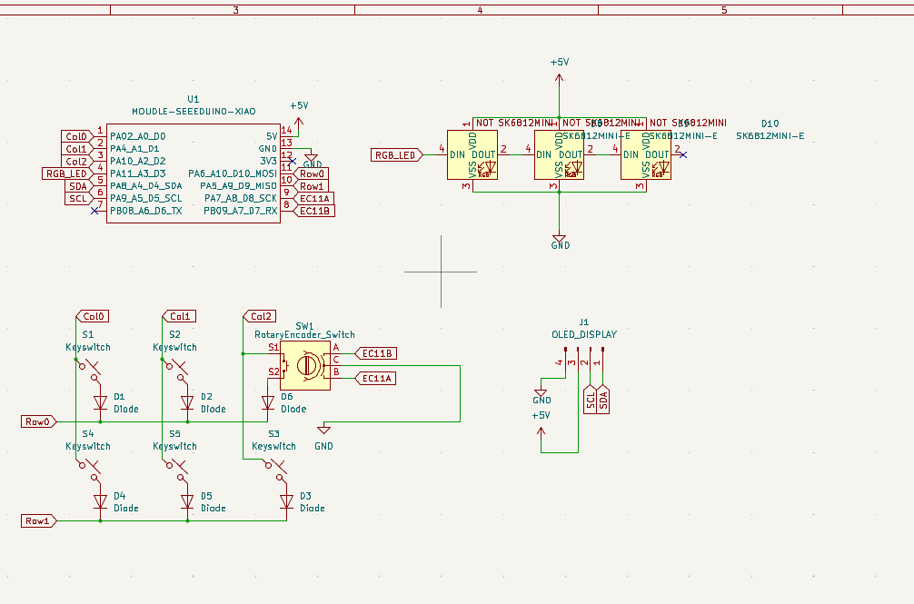
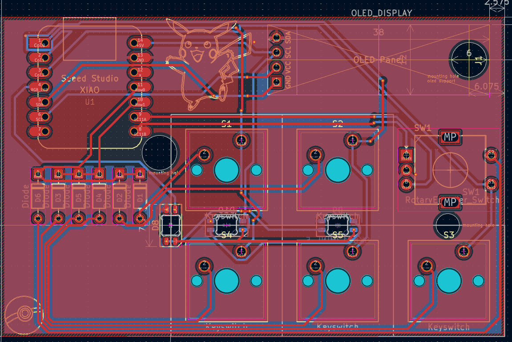
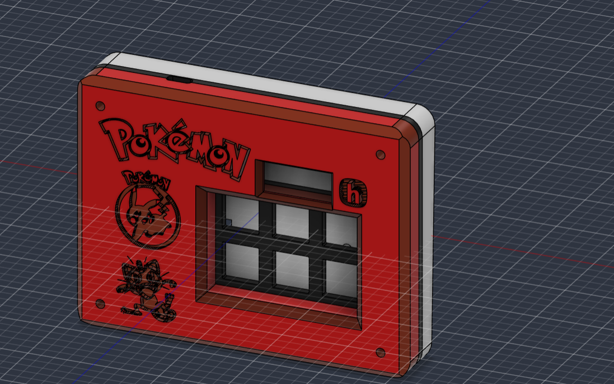

# Pokeyboardy

**Pokeyboardy** is a compact 5-key macropad built for Hack Club's Hackpad YSWS. It features five mechanical switches, a rotary encoder, RGB lighting, and support for a small OLED display, all powered by a Seeed Studio XIAO RP2040. The PCB, case, and knob were designed from scratch as part of the project.

## Features

- 5x Cherry MX switches
- 1x EC11 rotary encoder
- 3x SK6812 mini RGB LEDs
- Seeed XIAO controller
- OLED header

## Contents

| File | What it is |
|------|-----------|
| [Pokeyboardy.kicad_sch](Pokeyboardy.kicad_sch) | Schematic |
| [Pokeyboardy.kicad_pcb](Pokeyboardy.kicad_pcb) | Board layout |
| [Pokeyboardy Full w components.step](Pokeyboardy%20Full%20w%20components.step) | Full case assembly |
| [Pokeyboardy Full Case.step](Pokeyboardy%20Full%20Case.step) | Case only |
| [Pokeyboardy PCB.step](Pokeyboardy%20PCB.step) | PCB model |
| [Pokeyboardy knob.step](Pokeyboardy%20knob.step) | Rotary knob |
| [production/](production/) | Freshly generated gerbers, drill file and production zip |
| [Pokeyboardy.csv](Pokeyboardy.csv) | Component BOM |
| [lib/](lib/) | Footprints and 3D models used by the project |

## BOM

| Reference | Value | Footprint | Qty |
|-----------|-------|-----------|-----|
| D1-D4, D8, D10 | 1N4148 DO-35 diode | Diode_THT:D_DO-35_SOD27_P7.62mm_Horizontal | 6 |
| D5, D6, D9 | SK6812 mini | LED_SMD:LED_SK6812MINI-E_3.2x2.8mm_P1.5mm_ReverseMount | 3 |
| J1 | OLED display header | Connector_PinHeader_2.54mm:PinHeader_1x04_P2.54mm_Vertical | 1 |
| SW1 | EC11 rotary encoder | Rotary_Encoder:RotaryEncoder_Alps_EC11E-Switch_Vertical_H20mm | 1 |
| SW2-SW6 | Cherry MX switch | Button_Switch_Keyboard:SW_Cherry_MX_1.00u_PCB | 5 |
| U1 | Seeed Studio XIAO RP2040 | XIAO-Generic-Hybrid-14P-2.54-21X17.8MM | 1 |

Also needed: 5x DSA keycaps, 1x 0.91" 128x32 OLED, 6x M3 heatset inserts + bolts, 3D printed case + 2 acrylic plates.

## Firmware

The board runs [KMK](https://github.com/KMKfw/kmk_firmware) on [CircuitPython](https://circuitpython.org/). Copy `firmware/main.py` to the CIRCUITPY drive on a XIAO RP2040 to install.

| Key (matrix order) | Action |
|--------------------|--------|
| 1 | Ctrl+C |
| 2 | Ctrl+V |
| 3 | Mute |
| 4 | Ctrl+X |
| 5 | Ctrl+Z |
| 6 (empty slot) | Ctrl+Shift+Z |
| Encoder | Volume up / down |

## Building it

1. Populate the PCB: diodes (D1-D4, D8, D10), SK6812 LEDs (D5, D6, D9), MX sockets (SW2-SW6), EC11 encoder (SW1), OLED header (J1), and the XIAO RP2040 (U1)
2. Print the case parts and drop in the heatset inserts
3. Mount the PCB in the case, add the acrylic plates and screw it together
4. Flash the firmware: copy `firmware/main.py` to the CIRCUITPY drive
5. Put on the keycaps and the knob

## Schematic

## PCB

## CAD

## Credits

Huge thank you to Hack Club and everyone behind the [Hackpad YSWS](https://hackpad.hackclub.com/) for the parts, the guides, and the whole program - genuinely could not have built this without them.
